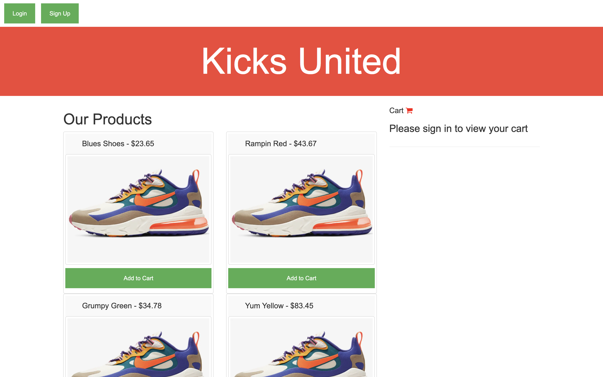

# Shoe Shop
An app that keeps track of customers purchases

## Description 
A shoe store app that allows users to login as members using passport and search for shoes listed in the stores database. When the user finds shoes they want to purchase they can add shoes to the cart and contiue checkout. User/Member infomation will be saved into the shops database to be used to keep track of their purchases.

## User Story
* As a shopper I want to log into a shoe store as a member
* Search for wanted shoes
* And add shoes to cart to checkout.

## Deployed Link 
[View Here](https:// )

## Screenshot 

## Installation 
Fork and run npm install in the terminal

## Usage
* Run npm start in the terminal
* Open localhost
* Use app

## Licence 
Public Domain

## Contributors
* Angelo Ungos
* Brock Hamann
* Claire Vandenberg 
* Damian Tapp
* Matt Teague
